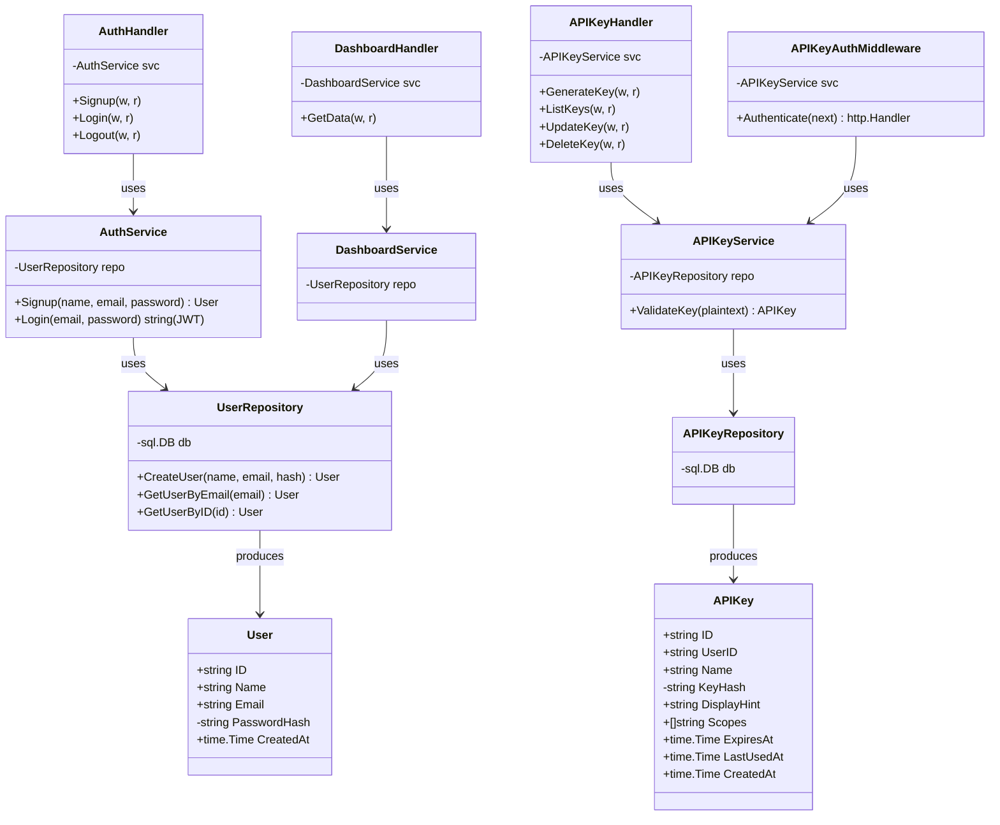

# 1. Class Diagram

This diagram maps every **Go struct** and **interface** in the Velox backend to the package it belongs to. Because Go does not have classes in the OOP sense, each struct is shown with its fields, and interfaces are shown with their method signatures.

---

## 1.1 Full Class Diagram — Judge Engine

```mermaid
classDiagram
    direction TB

    class SubmissionRequest {
        +string SubmissionID
        +string Language
        +string SourceCode
        +TestCase[] TestCases
        +int TimeLimitMs
        +int MemoryLimitKb
    }

    class TestCase {
        +int TestCaseID
        +string Input
        +string ExpectedOutput
    }

    class SubmissionResponse {
        +string SubmissionID
        +string OverallState
        +string CompileError
        +TestCaseResult[] Results
    }

    class TestCaseResult {
        +int TestCaseID
        +string Status
        +string ActualOutput
        +string Input
        +string ExpectedOutput
        +string Stderr
        +int64 TimeMs
        +int64 MemoryKb
    }

    class LanguageStrategy {
        <<interface>>
        +Prepare(ws Workspace, sourceCode string) (string, []string, error)
    }

    class CStrategy {
        +Prepare(ws, sourceCode) gcc compilation
    }
    class CPPStrategy {
        +Prepare(ws, sourceCode) g++ compilation
    }
    class JavaStrategy {
        +Prepare(ws, sourceCode) javac compilation
    }
    class CSharpStrategy {
        +Prepare(ws, sourceCode) dotnet build
    }
    class TSStrategy {
        +Prepare(ws, sourceCode) esbuild transpilation
    }
    class InterpreterStrategyManager {
        +string Executable
        +string FileExt
        +Prepare(ws, sourceCode) write script to disk
    }
    class PythonStrategy {
        +InterpreterStrategyManager (embedded)
    }
    class NodeStrategy {
        +InterpreterStrategyManager (embedded)
    }

    class BatchRunner {
        <<interface>>
        +RunBatch(execCmd, execArgs, testCases, timeLimitMs, memoryLimitKb) []TestCaseResult
    }
    class DefaultRunner {
        +RunBatch() delegates to runBatch.RunBatch
    }

    class StrategyRegistry {
        <<interface>>
        +Get(language) (LanguageStrategy, bool)
        +Register(language, strategy)
    }
    class DefaultStrategyRegistry {
        -map strategies
        +Get(language) (LanguageStrategy, bool)
        +Register(language, strategy)
    }

    class Workspace {
        <<interface>>
        +BaseDir() string
        +WriteFile(relativePath, content) (string, error)
        +GetAbsolutePath(relativePath) string
        +Clean() error
    }
    class LocalWorkspace {
        -string baseDir
        +BaseDir()
        +WriteFile()
        +GetAbsolutePath()
        +Clean()
    }

    class FileStorage {
        <<interface>>
        +CreateWorkspace(submissionID) (Workspace, error)
    }
    class LocalTempStorageAdapter {
        +CreateWorkspace(submissionID) os.TempDir based
    }

    class SubmissionService {
        -BatchRunner runner
        -StrategyRegistry registry
        -FileStorage storage
        +ProcessSubmission(req) SubmissionResponse
    }

    class ResultAggregator {
        +Aggregate(results) string
    }

    class RedisClient {
        <<singleton>> shared/redis
        +context.Context Ctx
        +redis.Client Client
        +Connect()
        +PopSubmission(queueName, timeout)
        +PushResult(queueName, data)
    }

    class APIServer {
        <<entrypoint>> cmd/api
        +main()
        +submitHandler()
        +statusHandler()
        +healthHandler()
    }

    class WorkerProcess {
        <<entrypoint>> cmd/worker
        +main()
    }

    %% Strategy Pattern
    LanguageStrategy <|.. CStrategy : implements
    LanguageStrategy <|.. CPPStrategy : implements
    LanguageStrategy <|.. JavaStrategy : implements
    LanguageStrategy <|.. CSharpStrategy : implements
    LanguageStrategy <|.. TSStrategy : implements
    LanguageStrategy <|.. InterpreterStrategyManager : implements
    InterpreterStrategyManager <|-- PythonStrategy : embeds (Composition)
    InterpreterStrategyManager <|-- NodeStrategy : embeds (Composition)

    %% Adapter Pattern
    BatchRunner <|.. DefaultRunner : implements
    StrategyRegistry <|.. DefaultStrategyRegistry : implements
    Workspace <|.. LocalWorkspace : implements
    FileStorage <|.. LocalTempStorageAdapter : implements

    %% Composition
    SubmissionRequest "1" *-- "many" TestCase : contains
    SubmissionResponse "1" *-- "many" TestCaseResult : contains
    SubmissionService --> BatchRunner : uses
    SubmissionService --> StrategyRegistry : uses
    SubmissionService --> FileStorage : uses
    SubmissionService --> ResultAggregator : uses

    %% System flow
    APIServer ..> RedisClient : pushes to queue
    WorkerProcess ..> RedisClient : pops from queue
    WorkerProcess ..> SubmissionService : calls
    SubmissionService ..> SubmissionRequest : consumes
    SubmissionService ..> SubmissionResponse : produces
```

---

## 1.2 Auth Module Class Diagram

---

## 1.3 Explanation

### `judge` Package — Data Models (Domain Model Pattern)
This package defines the **four core data structures** that travel through the entire system:

| Struct | Purpose |
|--------|---------|
| `SubmissionRequest` | The incoming JSON payload from the client. Contains the user's source code, the programming language, and an array of test cases. |
| `TestCase` | A single input/expected-output pair. A submission can contain up to 20 test cases. |
| `SubmissionResponse` | The final verdict returned to the client. Carries the overall state (Accepted, Wrong Answer, Compile Error, etc.) and per-test-case results. |
| `TestCaseResult` | The result of running one test case — status, actual output, time (ms), and memory (KB). |

### `processSubmission` Package — Language Orchestrator (Strategy Pattern)
Contains the **core routing logic** using the **Strategy Pattern**:
1. `LanguageStrategy` interface defines the contract for all language handlers.
2. Each language (C, C++, Java, C#, TS, Python, Node) has its own Strategy implementation.
3. `DefaultStrategyRegistry` manages the mapping from language name to strategy.
4. Python and Node use the **Composition Pattern** by embedding `InterpreterStrategyManager`.
5. Delegates execution to `BatchRunner` (another interface — **Adapter Pattern**).
6. `ResultAggregator` follows **Single Responsibility Principle (SRP)**.

### `auth` Module — Clean Architecture (Repository → Service → Handler)
Follows a strict **3-layered architecture**:
- **Model Layer** — `User`, `APIKey` structs (data transfer objects).
- **Repository Layer** — Direct SQL queries, sentinel errors (`ErrEmailExists`, `ErrUserNotFound`).
- **Service Layer** — Business logic, JWT generation/validation, password hashing (bcrypt).
- **Handler Layer** — HTTP request/response, delegates to services.
- **Middleware Layer** — `RequireAuth` (JWT), `APIKeyAuthMiddleware`, `SecurityHeaders`, `CheckScope`.
