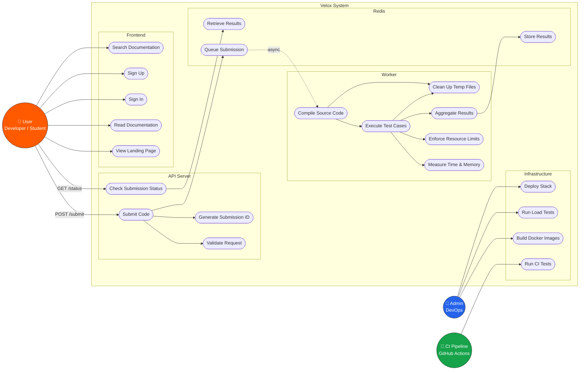
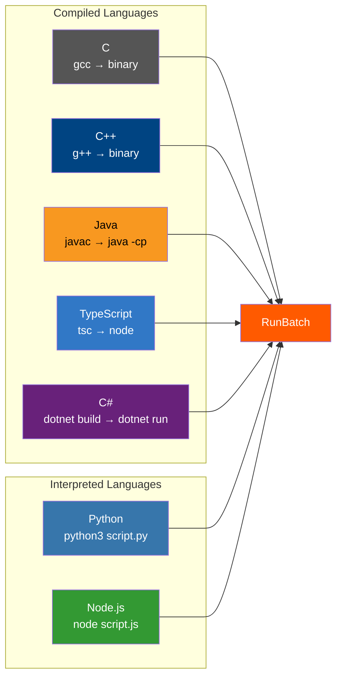

# 4. Use Case Diagram

This document identifies all **actors** in the Velox system and the **operations** they perform or participate in.

---

## 4.1 System Use Case Diagram

---

## 4.2 Detailed Use Case Descriptions

### UC1: Submit Code
| Field | Value |
|-------|-------|
| **Actor** | User |
| **Trigger** | `POST /submit` with JSON body |
| **Preconditions** | Request body contains `language`, `source_code`, and at least one `test_case` |
| **Flow** | 1. API validates `TimeLimitMs ≤ 5000` and `MemoryLimitKb ≤ 512000`   2. Generate UUID via `uuid.New()`   3. Serialize request to JSON   4. `LPUSH` to Redis `"submissions"` queue   5. Return `202 Accepted` with `submission_id` |
| **Postconditions** | Submission is queued for processing |
| **Error Cases** | Invalid JSON → 400, Limits too high → 400, Redis push failure → 500 |

### UC2: Check Submission Status
| Field | Value |
|-------|-------|
| **Actor** | User |
| **Trigger** | `GET /status?submission_id=<id>` |
| **Preconditions** | A submission with the given ID was previously submitted |
| **Flow** | 1. Extract `submission_id` from query params   2. `BRPOP "results:<id>"` with 1s timeout   3a. If found → return the full response JSON   3b. If timeout → return `{"status": "pending"}` |
| **Postconditions** | Client receives result or pending status |
| **Error Cases** | Missing `submission_id` → 400 |

### UC3: Validate Request
| Field | Value |
|-------|-------|
| **Actor** | API Server (internal) |
| **Checks** | HTTP method is POST, JSON is valid, `TimeLimitMs ≤ 5000`, `MemoryLimitKb ≤ 512000` |

### UC5: Compile Source Code
| Field | Value |
|-------|-------|
| **Actor** | Worker (internal) |
| **Supported Languages** | C (gcc), C++ (g++), Java (javac), TypeScript (tsc), C# (dotnet build) |
| **Interpreted Languages** | Python, Node.js — no compilation, file is written to temp dir and executed directly |
| **Error Output** | Compiler stderr is captured and returned as `CompileError` field |

### UC6: Execute Test Cases
| Field | Value |
|-------|-------|
| **Actor** | Worker → RunBatch (internal) |
| **Flow** | For each test case:   1. Create context with timeout   2. Run binary/script with `stdin` piped from test input   3. Capture `stdout`, `stderr`   4. Measure CPU time and peak memory   5. Compare actual output to expected output |
| **Possible Statuses** | `Accepted`, `Wrong Answer`, `Runtime Error`, `Time Limit Exceeded`, `Memory Limit Exceeded` |

### UC8: Enforce Resource Limits
| Field | Value |
|-------|-------|
| **Actor** | RunBatch (internal) |
| **Time Limit** | Enforced via `context.WithTimeout`. Default: 3000ms. Max: 5000ms. |
| **Memory Limit** | Measured via `syscall.Rusage.Maxrss`. Default: 256MB. Max: 512MB. Platform-aware (macOS divides by 1024). |

### UC20: Run Load Tests
| Field | Value |
|-------|-------|
| **Actor** | Admin / Developer |
| **Tool** | `tests/load_test_cmd.go` |
| **Behavior** | Sends 20 concurrent submissions per language (7 languages × 20 = 140 total), polls for results, and prints percentile-based performance metrics (P50, P90, P95, P99). |

### UC22: Run CI Tests
| Field | Value |
|-------|-------|
| **Actor** | GitHub Actions CI pipeline |
| **Trigger** | Push to `main` or Pull Request to `main` |
| **Strategy** | 3-job pipeline: (1) Matrix unit tests per language (C, CPP, Java, Node, Python, TS, CSharp), (2) Build load test binary from tests/load/, (3) Build performance test binary from tests/performance/ |
| **Command** | `go test -v -race ./processSubmission -run TestProcessSubmission_<Language>$` |

---

## 4.3 Supported Languages Matrix

The system supports 7 programming languages. Each language follows a specific execution pipeline:

