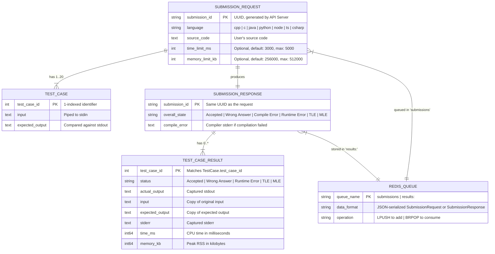
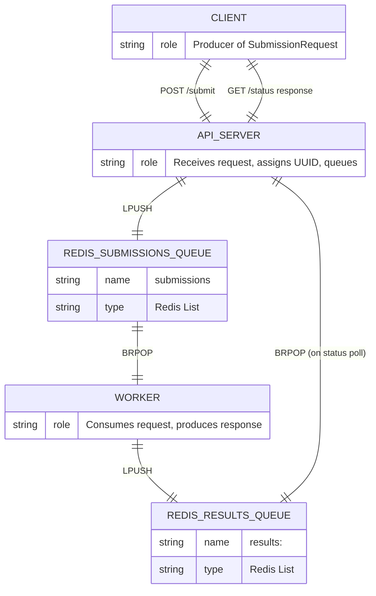
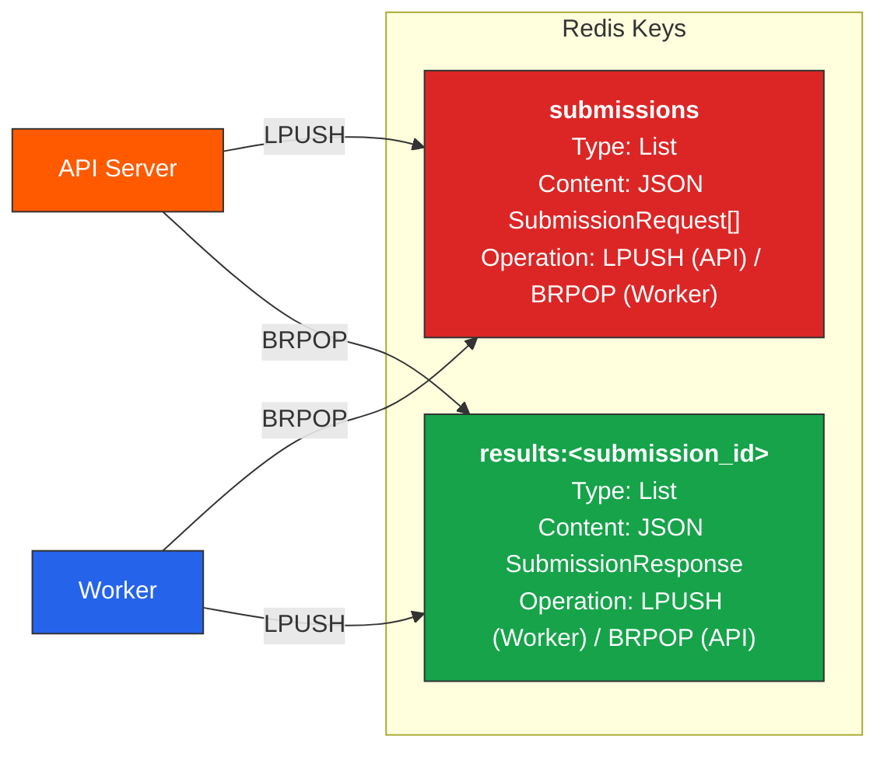

# 5. ER Diagram (Entity-Relationship)

This document models the **data entities** in Velox and their relationships. Since Velox does not use a traditional database (it uses Redis as a transient message queue), this ER diagram models the logical data structures that flow through the system as JSON payloads.

---

## 5.1 Core ER Diagram

---

## 5.2 Data Lifecycle ER Diagram

This shows how each entity is created, stored, and consumed over time.

---

## 5.3 Entity Field Reference

### SUBMISSION_REQUEST

| Field | Type | JSON Key | Required | Description |
|-------|------|----------|----------|-------------|
| SubmissionID | string | `submission_id` | Auto-generated | UUID v4, assigned by the API server via `uuid.New()` |
| Language | string | `language` | Yes | One of: `c`, `cpp`, `java`, `python`, `node`, `ts`, `csharp` |
| SourceCode | string | `source_code` | Yes | Complete source code as a string |
| TestCases | []TestCase | `test_cases` | Yes | Array of 1–20 test cases |
| TimeLimitMs | int | `time_limit_ms` | No | Defaults to 3000ms if ≤ 0. Max: 5000ms. |
| MemoryLimitKb | int | `memory_limit_kb` | No | Defaults to 256000 KB if ≤ 0. Max: 512000 KB. |

### TEST_CASE

| Field | Type | JSON Key | Required | Description |
|-------|------|----------|----------|-------------|
| TestCaseID | int | `test_case_id` | Yes | Sequential identifier (1, 2, 3, ...) |
| Input | string | `input` | Yes | Input string piped to the program's stdin |
| ExpectedOutput | string | `expected_output` | Yes | Expected stdout output (whitespace-trimmed for comparison) |

### SUBMISSION_RESPONSE

| Field | Type | JSON Key | Required | Description |
|-------|------|----------|----------|-------------|
| SubmissionID | string | `submission_id` | Always | Same UUID from the request |
| OverallState | string | `overall_state` | Always | One of: `Accepted`, `Wrong Answer`, `Compile Error`, `Runtime Error`, `Time Limit Exceeded`, `Memory Limit Exceeded`, `Unsupported Language`, `System Error: Cannot write to RAM` |
| CompileError | string | `compile_error` | Only on compile error | The compiler's stderr output |
| Results | []TestCaseResult | `results` | When available | Per-test-case results |

### TEST_CASE_RESULT

| Field | Type | JSON Key | Required | Description |
|-------|------|----------|----------|-------------|
| TestCaseID | int | `test_case_id` | Always | Matches the input TestCase ID |
| Status | string | `status` | Always | `Accepted`, `Wrong Answer`, `Runtime Error`, `Time Limit Exceeded`, `Memory Limit Exceeded` |
| ActualOutput | string | `actual_output` | On success/wrong answer | Trimmed stdout of the user's program |
| Input | string | `input` | Always | Copy of the actual output (note: this is a known field mapping in the code) |
| ExpectedOutput | string | `expected_output` | Always | Copy of the expected output |
| Stderr | string | `stderr` | On error | Captured stderr from the process |
| TimeMs | int64 | `time_ms` | Always | CPU time (user + system) in milliseconds |
| MemoryKb | int64 | `memory_kb` | Always | Peak Resident Set Size in KB |

---

## 5.4 Redis Key Schema

Velox uses Redis as a transient job queue. Data is **not persisted long-term** — once a result is popped, it is consumed and removed.

### Key Points:
- **`submissions`** — A single shared queue. All API server instances push to it. All worker instances pop from it. This naturally provides load balancing.
- **`results:<submission_id>`** — A unique queue per submission. The worker pushes exactly one result. The API's status handler pops it when the client polls. After consumption, the key is effectively empty and will be garbage-collected by Redis.
- **No TTL is set** — Results remain in Redis until consumed. A long-running unclaimed result will persist indefinitely. This is a potential area for improvement.
