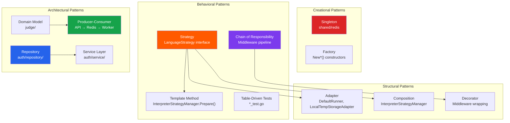

# 7. Design Patterns Reference

A comprehensive catalog of all **design patterns**, **architectural patterns**, and **software engineering principles** applied throughout the Velox codebase.

---

## Table of Contents

| # | Pattern | Category | Primary Location |
|---|---------|----------|-----------------|
| 1 | [Strategy Pattern](#1-strategy-pattern) | Behavioral | `processSubmission/` |
| 2 | [Composition Pattern](#2-composition-pattern) | Structural | `InterpreterStrategyManager` |
| 3 | [Adapter Pattern](#3-adapter-pattern) | Structural | `DefaultRunner`, `LocalTempStorageAdapter` |
| 4 | [Repository Pattern](#4-repository-pattern) | Data Access | `auth/repository/` |
| 5 | [Service Layer Pattern](#5-service-layer-pattern) | Architectural | `auth/service/` |
| 6 | [Middleware / Chain of Responsibility](#6-middleware--chain-of-responsibility) | Behavioral | `auth/middleware/` |
| 7 | [Producer-Consumer Pattern](#7-producer-consumer-pattern) | Concurrency | API → Redis → Worker |
| 8 | [Singleton Pattern](#8-singleton-pattern) | Creational | `shared/redis/` |
| 9 | [Template Method Pattern](#9-template-method-pattern) | Behavioral | `InterpreterStrategyManager` |
| 10 | [Table-Driven Tests](#10-table-driven-tests) | Testing | `processSubmission/*_test.go` |
| 11 | [Domain Model Pattern](#11-domain-model-pattern) | Architectural | `judge/` |
| 12 | [Factory Pattern](#12-factory-pattern) | Creational | `NewDefaultRegistry()`, `NewSubmissionService()` |
| 13 | [CORS Middleware](#13-cors-middleware-pattern) | Infrastructure | `cmd/api/main.go` |
| 14 | [Decorator Pattern](#14-decorator-pattern) | Structural | Middleware wrapping |
| 15 | [Single Responsibility Principle](#15-single-responsibility-principle-srp) | SOLID | `ResultAggregator`, separated packages |

---

## 1. Strategy Pattern

**Category:** Behavioral  
**GoF Classification:** Strategy  
**Location:** `backend/processSubmission/processSubmission.go`

### What It Does
Defines a family of algorithms (one per programming language), encapsulates each one, and makes them interchangeable. The `SubmissionService` delegates compilation/preparation to whichever strategy is registered for the requested language.

### Interface

```go
type LanguageStrategy interface {
    Prepare(ws Workspace, sourceCode string) (execCmd string, execArgs []string, err error)
}
```

### Implementations

| Strategy | Language | Compiler/Runtime | File |
|----------|----------|-----------------|------|
| `CStrategy` | C | `gcc -O2` | `processSubmission.go` |
| `CPPStrategy` | C++ | `g++ -O2` | `processSubmission.go` |
| `JavaStrategy` | Java | `javac` → `java -cp` | `processSubmission.go` |
| `CSharpStrategy` | C# | `dotnet build` → `dotnet run` | `processSubmission.go` |
| `TSStrategy` | TypeScript | `tsc` → `node` | `processSubmission.go` |
| `PythonStrategy` | Python | `python3` (interpreted) | `processSubmission.go` |
| `NodeStrategy` | Node.js | `node` (interpreted) | `processSubmission.go` |

### How It's Used

```go
strategy, exists := s.registry.Get(req.Language)  // O(1) lookup
cmd, args, err := strategy.Prepare(ws, req.SourceCode)
results := s.runner.RunBatch(cmd, args, ...)
```

### Why
- **Open/Closed Principle** — Adding a new language (e.g., Rust) means creating a new struct implementing `LanguageStrategy` and registering it. Zero changes to `ProcessSubmission()`.
- **Eliminates switch/case** — The old approach used a giant switch block; the Strategy Pattern replaces it with polymorphic dispatch.

---

## 2. Composition Pattern

**Category:** Structural  
**Location:** `backend/processSubmission/processSubmission.go`

### What It Does
Python and Node.js share identical preparation logic (write source to disk, return interpreter path). Instead of duplicating code, a shared `InterpreterStrategyManager` is embedded into both strategies via Go's struct embedding.

### Implementation

```go
type InterpreterStrategyManager struct {
    Executable string  // "python3" or "node"
    FileExt    string  // ".py" or ".js"
}

func (m *InterpreterStrategyManager) Prepare(ws Workspace, sourceCode string) (string, []string, error) {
    scriptPath, err := ws.WriteFile("solution" + m.FileExt, []byte(sourceCode))
    return m.Executable, []string{scriptPath}, nil
}

type PythonStrategy struct {
    InterpreterStrategyManager  // Embedded — gains Prepare() for free
}

type NodeStrategy struct {
    InterpreterStrategyManager  // Embedded — gains Prepare() for free
}
```

### Why
- **DRY (Don't Repeat Yourself)** — Both interpreted languages share the same preparation flow.
- **Go-idiomatic** — Go favors composition over inheritance. Struct embedding is Go's mechanism for code reuse.

---

## 3. Adapter Pattern

**Category:** Structural  
**GoF Classification:** Adapter  
**Location:** `backend/processSubmission/`

### What It Does
Adapts concrete implementations behind interfaces so that `SubmissionService` depends only on abstractions, not concretions.

### Adapters

| Interface | Adapter | Wraps |
|-----------|---------|-------|
| `BatchRunner` | `DefaultRunner` | `runBatch.RunBatch()` function |
| `FileStorage` | `LocalTempStorageAdapter` | `os.TempDir()` + filesystem |
| `Workspace` | `LocalWorkspace` | Local directory operations |
| `StrategyRegistry` | `DefaultStrategyRegistry` | `map[string]LanguageStrategy` |

### Example

```go
// Interface
type BatchRunner interface {
    RunBatch(execCmd string, execArgs []string, testCases []judge.TestCase,
             timeLimitMs int, memoryLimitKb int) []judge.TestCaseResult
}

// Adapter
type DefaultRunner struct{}

func (r *DefaultRunner) RunBatch(...) []judge.TestCaseResult {
    return runBatch.RunBatch(...)  // Delegates to the concrete package
}
```

### Why
- **Dependency Inversion Principle** — `SubmissionService` depends on `BatchRunner` (interface), not `runBatch` (package).
- **Testability** — In tests, you can inject a mock `BatchRunner` that returns predetermined results without actually executing code.

---

## 4. Repository Pattern

**Category:** Data Access  
**Location:** `backend/auth/repository/`

### What It Does
Encapsulates all SQL queries behind a repository struct. The service layer never writes raw SQL — it calls repository methods that return domain models.

### Repositories

| Repository | Table | Operations |
|------------|-------|-----------|
| `UserRepository` | `users` | `CreateUser()`, `GetUserByEmail()`, `GetUserByID()` |
| `APIKeyRepository` | `api_keys` | Key CRUD operations |

### Sentinel Errors

```go
var ErrEmailExists = errors.New("email already exists")
var ErrUserNotFound = errors.New("user not found")
```

### Why
- **Separation of Concerns** — SQL lives in one place. If you switch from PostgreSQL to MySQL, only the repository changes.
- **Testability** — Easy to mock the repository for unit-testing services.
- **Error Semantics** — Sentinel errors translate database-level errors (e.g., unique constraint violation `23505`) into domain-level errors (`ErrEmailExists`).

---

## 5. Service Layer Pattern

**Category:** Architectural  
**Location:** `backend/auth/service/`

### What It Does
All business logic lives in the service layer — password hashing, JWT generation/validation, input validation. Services consume repositories and produce results that handlers can serialize to JSON.

### Services

| Service | Responsibilities |
|---------|-----------------|
| `AuthService` | Signup (hash + persist), Login (verify + JWT), Input validation |
| `DashboardService` | Dashboard data aggregation |
| `APIKeyService` | Key generation, validation (CSPRNG hash), scope checking |

### Example

```go
func (s *AuthService) Login(email, password string) (string, error) {
    // 1. Validate input
    // 2. Fetch user from repository
    // 3. Compare bcrypt hashes
    // 4. Generate JWT
    return token, nil
}
```

### Why
- **Separation from HTTP** — Services know nothing about `http.Request` or `http.ResponseWriter`.
- **Reusability** — The same `AuthService` could be used in a gRPC server, CLI tool, or background job.

---

## 6. Middleware / Chain of Responsibility

**Category:** Behavioral  
**Location:** `backend/auth/middleware/`

### What It Does
Each middleware is a function `func(next http.Handler) http.Handler` that wraps the next handler. They form a chain where each link can inspect, modify, or reject the request.

### Middleware Chain

```
Request → SecurityHeaders → CORS → APIKeyAuth → CheckScope → Handler → Response
```

| Middleware | Purpose |
|-----------|---------|
| `SecurityHeaders` | Adds `X-Content-Type-Options`, `X-Frame-Options`, `CSP`, `Referrer-Policy` |
| `corsMiddleware` | Sets `Access-Control-Allow-*` headers, handles `OPTIONS` preflight |
| `RequireAuth` | Validates JWT Bearer token, injects `userID` into `context` |
| `APIKeyAuthMiddleware.Authenticate` | Validates API key, injects `userID` + `scopes` into `context` |
| `CheckScope` | Verifies the API key has the required scope (e.g., `"submit"`, `"status"`) |

### Why
- **Separation of Concerns** — Authentication logic is not mixed with business logic.
- **Composability** — Middlewares can be stacked in any order. Some routes use JWT auth, others use API key auth.
- **Context Propagation** — User identity flows through `context.Value` — no global state.

---

## 7. Producer-Consumer Pattern

**Category:** Concurrency  
**Location:** `cmd/api/`, `cmd/worker/`, `shared/redis/`

### What It Does
The API server **produces** jobs (submissions) by pushing to a Redis list. The Worker **consumes** jobs by blocking-popping from the same list.

### Flow

```
API Server ──LPUSH──▸ Redis["submissions"] ◂──BRPOP── Worker
Worker ──LPUSH──▸ Redis["results:<id>"] ◂──BRPOP── API Server (on poll)
```

### Why
- **Decoupling** — The API server and worker run in separate containers. They communicate only through Redis.
- **Scalability** — You can run 1 API server and 10 workers. Redis naturally load-balances via BRPOP.
- **Non-blocking** — The API returns `202 Accepted` immediately. The user polls for results.
- **Resilience** — If the worker crashes, the job stays in Redis until another worker picks it up.

---

## 8. Singleton Pattern

**Category:** Creational  
**Location:** `backend/shared/redis/redis.go`

### What It Does
A single Redis client instance is created via `Connect()` and stored in a package-level variable. All goroutines share this connection pool.

```go
var Client *redis.Client   // Package-level singleton

func Connect() {
    Client = redis.NewClient(&redis.Options{
        PoolSize:     1000,
        MinIdleConns: 100,
        ...
    })
}
```

### Why
- **Connection Pool** — The Redis client manages a pool of 1000 connections. Creating multiple clients would waste resources.
- **Simplicity** — Every part of the codebase can call `veloxRedis.PushResult()` without worrying about connection management.

---

## 9. Template Method Pattern

**Category:** Behavioral  
**Location:** `backend/processSubmission/processSubmission.go`

### What It Does
`InterpreterStrategyManager.Prepare()` defines the skeleton of the algorithm (write file → return interpreter path). Substrategies (`PythonStrategy`, `NodeStrategy`) inherit this behavior via embedding. They can override `Prepare()` if needed, but the default implementation handles the common case.

This is closely related to the **Composition Pattern** (#2) — Go achieves the Template Method via embedding rather than abstract base classes.

---

## 10. Table-Driven Tests

**Category:** Testing  
**Location:** `backend/processSubmission/*_test.go`

### What It Does
All test files follow Go's table-driven test pattern. A shared `ExecutionTestCase` struct defines test parameters, and `runLanguageTests()` iterates over them.

```go
type ExecutionTestCase struct {
    Name          string
    SourceCode    string
    TestCases     []judge.TestCase
    ExpectedState string  // "Accepted", "Compile Error", etc.
}
```

### Why
- **DRY** — Adding a new test case means adding one struct literal, not writing a new test function.
- **Consistency** — All languages use the same harness, so test coverage is uniform.
- **Readability** — The test intent is clear from the struct fields.

---

## 11. Domain Model Pattern

**Category:** Architectural  
**Location:** `backend/judge/judge.go`

### What It Does
The `judge` package defines pure data structures with no business logic. It serves as the **domain model** — the shared vocabulary between all layers (API, worker, processSubmission, runBatch).

### Why
- **Single Source of Truth** — All packages import `judge` for data types. There are no duplicate struct definitions.
- **Zero Dependencies** — `judge` imports nothing from the project. It's the root of the dependency tree.

---

## 12. Factory Pattern

**Category:** Creational  
**Location:** `backend/processSubmission/processSubmission.go`, `backend/auth/`

### What It Does
Constructor functions create and configure complex objects:

| Factory | Creates | Configures |
|---------|---------|-----------|
| `NewDefaultRegistry()` | `DefaultStrategyRegistry` | Registers all 7 language strategies |
| `NewSubmissionService(runner, registry, storage)` | `SubmissionService` | Wires all dependencies |
| `NewAuthService(repo)` | `AuthService` | Injects repository |
| `NewUserRepository(db)` | `UserRepository` | Injects database connection |
| `NewAPIKeyAuthMiddleware(svc)` | `APIKeyAuthMiddleware` | Injects API key service |

### Why
- **Dependency Injection** — All dependencies are passed in explicitly. No hidden globals.
- **Testability** — In tests, you can pass mock implementations.

---

## 13. CORS Middleware Pattern

**Category:** Infrastructure  
**Location:** `backend/cmd/api/main.go`

### What It Does
Environment-aware CORS middleware that allows all origins in development and restricts to a specific domain in production.

```go
if env == "" || env == "development" {
    allowedOrigin = "*"
} else {
    allowedOrigin = "https://example.com"
}
```

### Why
- **Security** — Production environments restrict cross-origin requests.
- **Developer Experience** — Development allows any origin for easy frontend testing.

---

## 14. Decorator Pattern

**Category:** Structural  
**Location:** `backend/cmd/api/main.go`, `backend/auth/middleware/`

### What It Does
HTTP handlers are wrapped (decorated) with additional behavior without modifying the handler itself.

```go
// Wrapping order: SecurityHeaders → CORS → APIKeyAuth → CheckScope → submitHandler
http.Handle("/submit", apiKeyMiddleware.Authenticate(middleware.CheckScope("submit", submitMux)))
handler := middleware.SecurityHeaders(corsMiddleware(http.DefaultServeMux))
```

Each wrapper adds one responsibility (authentication, CORS, security headers) while the core handler focuses on business logic.

---

## 15. Single Responsibility Principle (SRP)

**Category:** SOLID  
**Location:** Throughout the codebase

### Applications

| Component | Single Responsibility |
|-----------|----------------------|
| `ResultAggregator` | Only aggregates test results into an overall state |
| `parseLimits()` | Only applies default values for time/memory limits |
| `judge` package | Only defines data structures |
| `runBatch` package | Only executes binaries and measures resources |
| `shared/redis` | Only manages Redis connection and queue operations |
| Each `*Strategy` | Only handles compilation for one language |

---

## Summary: Pattern Map


