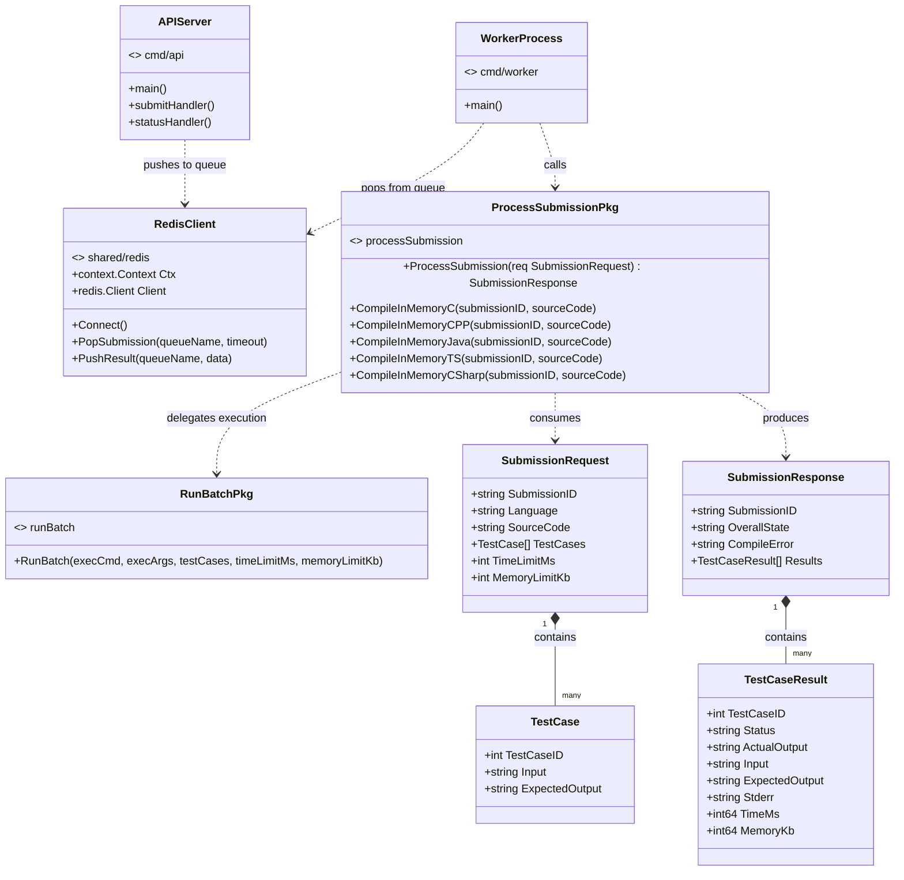

# 1. Class Diagram

This diagram maps every **Go struct** and **standalone function** in the Velox backend to the package it belongs to. Because Go does not have classes in the OOP sense, each struct is shown with its fields, and package-level functions are listed as static operations on a utility class named after the package.

---

## 1.1 Full Class Diagram

---

## 1.2 Explanation

### `judge` Package — Data Models
This package defines the **four core data structures** that travel through the entire system:

| Struct | Purpose |
|--------|---------|
| `SubmissionRequest` | The incoming JSON payload from the client. Contains the user's source code, the programming language, and an array of test cases. |
| `TestCase` | A single input/expected-output pair. A submission can contain up to 20 test cases. |
| `SubmissionResponse` | The final verdict returned to the client. Carries the overall state (Accepted, Wrong Answer, Compile Error, etc.) and per-test-case results. |
| `TestCaseResult` | The result of running one test case — status, actual output, time (ms), and memory (KB). |

### `processSubmission` Package — Language Orchestrator
Contains the **core routing logic** that:
1. Reads the `Language` field from the request.
2. Calls the appropriate compiler function (for compiled languages) or writes a script to disk (for interpreted languages).
3. Delegates the actual execution to `runBatch.RunBatch()`.
4. Aggregates results and returns a `SubmissionResponse`.

Each `CompileInMemoryXxx` function writes source code to a temp file, invokes the compiler CLI (`gcc`, `g++`, `javac`, `dotnet build`, `npx tsc`), and returns the path to the executable.

### `runBatch` Package — Execution Engine
A single function `RunBatch()` iterates over every `TestCase`, runs the compiled binary or script with the test input piped to `stdin`, captures `stdout`/`stderr`, and measures wall-clock time + memory usage via `syscall.Rusage`. It also enforces time and memory limits, returning `Time Limit Exceeded` or `Memory Limit Exceeded` statuses.

### `shared/redis` Package — Message Queue Wrapper
A thin abstraction over `go-redis`:
- `Connect()` — establishes a connection pool (1000 max connections, 100 min idle).
- `PushResult()` — pushes a JSON string into a Redis list (`LPUSH`).
- `PopSubmission()` — blocking pop from a Redis list (`BRPOP`).

### `cmd/api` — API Server Entry Point
Starts an HTTP server on `:8080` with two routes:
- `POST /submit` — validates the request, generates a UUID, pushes to the `submissions` queue, and returns `202 Accepted`.
- `GET /status?submission_id=...` — pops from `results:<id>` queue. Returns `{"status":"pending"}` if no result yet.

### `cmd/worker` — Worker Entry Point
An infinite loop that:
1. Calls `PopSubmission("submissions", 5s)` to block-wait for a job.
2. Unmarshals the JSON into a `SubmissionRequest`.
3. Calls `processSubmission.ProcessSubmission()`.
4. Marshals the response and pushes it to `results:<submission_id>`.
