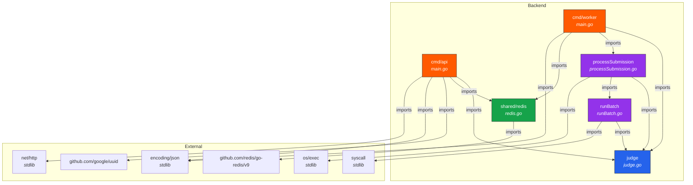
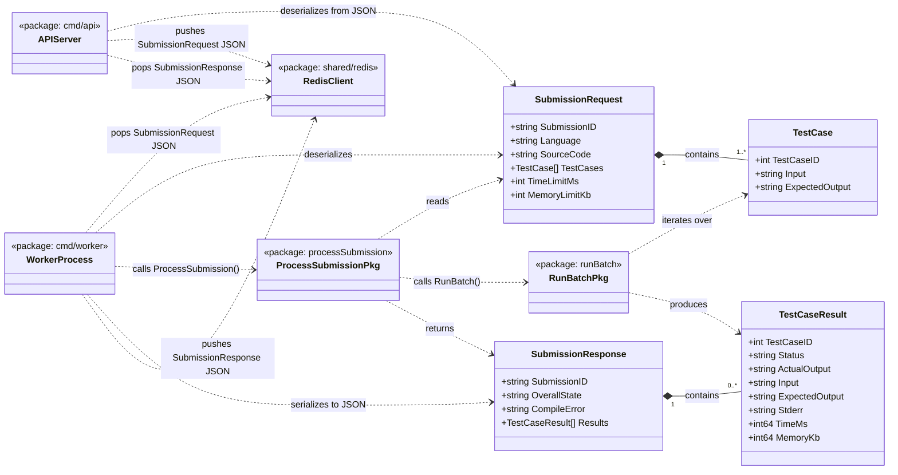
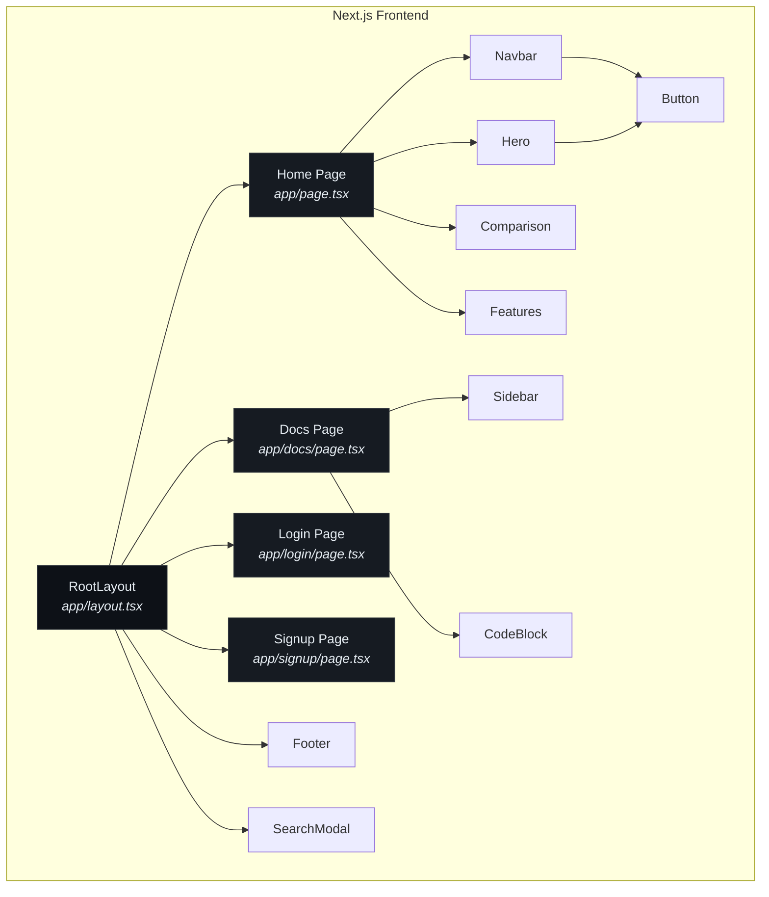

# 2. Relationship Diagram

This document shows **how every package and struct depends on the others** — both at the package level (import graph) and at the struct level (data flow).

---

## 2.1 Package-Level Dependency Graph

This shows which Go packages import which other packages.

---

## 2.2 Struct-Level Relationship Diagram

This shows how data structures relate to each other and flow through the system.

---

## 2.3 Frontend Component Hierarchy

---

## 2.4 Explanation

### Package Dependencies (Section 2.1)

| Package | Depends On | Why |
|---------|-----------|-----|
| `cmd/api` | `judge`, `shared/redis`, `uuid`, `net/http`, `encoding/json` | The API server needs the data models (`judge`), the Redis wrapper to push/pop, UUID generation, and the HTTP server. |
| `cmd/worker` | `judge`, `processSubmission`, `shared/redis`, `encoding/json` | The worker deserializes submissions, processes them, and pushes results. |
| `processSubmission` | `judge`, `runBatch`, `os/exec` | The orchestrator needs data models, the batch runner, and `os/exec` to compile code. |
| `runBatch` | `judge`, `syscall` | The execution engine needs data models and `syscall.Rusage` for memory measurement. |
| `shared/redis` | `go-redis/v9` | Thin wrapper around the Redis client library. |

### Key Design Decisions

1. **`judge` is the dependency root** — It defines the data contracts and is imported by every other package. It imports nothing from the project. This is a clean "domain model" layer.

2. **`processSubmission` depends on `runBatch`, not the reverse** — The orchestrator delegates to the execution engine, creating a clear one-way dependency.

3. **`cmd/api` and `cmd/worker` are independent** — They do not import each other. They communicate exclusively through Redis queues that carry serialized `judge` structs. This enables independent scaling.

4. **The frontend is fully decoupled** — It communicates with the backend exclusively via HTTP (`/submit` and `/status`). There are no shared types or imports between the Go backend and the Next.js frontend.
