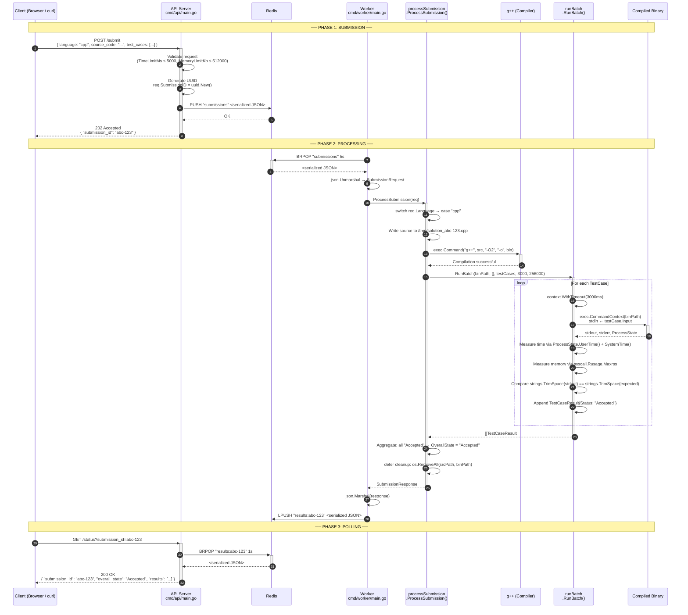
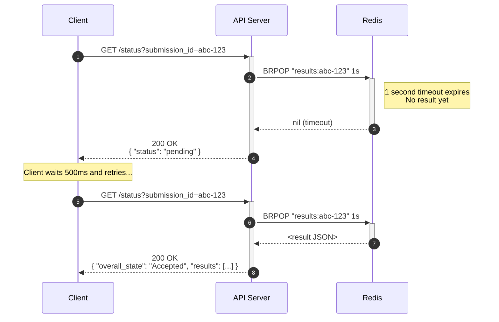
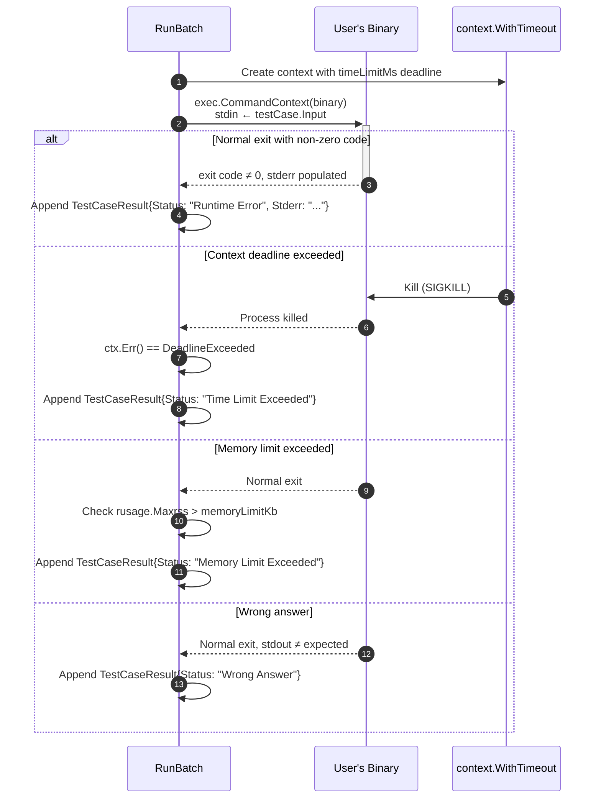
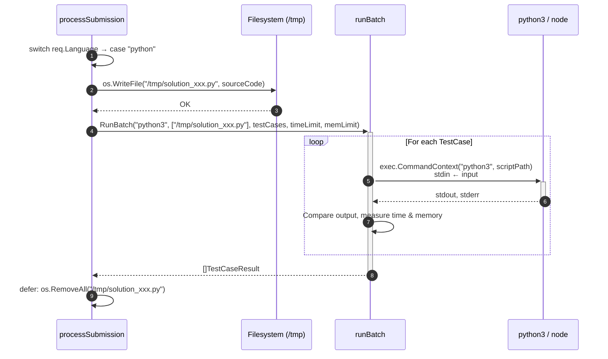

# 3. Sequence Diagrams

These diagrams show the **exact message flow** for every user-facing operation in Velox, tracing every function call, Redis operation, and HTTP exchange from start to finish.

---

## 3.1 Code Submission Flow (Happy Path — Compiled Language, e.g. C++)

This is the complete end-to-end flow from the user submitting code to receiving "Accepted".



---

## 3.2 Submission Flow — Compile Error Path

When the user's code has a syntax error and fails compilation.

```mermaid
sequenceDiagram
    autonumber
    participant Client as Client
    participant API as API Server
    participant Redis as Redis
    participant Worker as Worker
    participant PS as processSubmission
    participant Compiler as Compiler (gcc/g++/javac)

    Client->>+API: POST /submit { language: "cpp", source_code: "bad code..." }
    API->>API: Generate UUID
    API->>Redis: LPUSH "submissions" <JSON>
    API-->>-Client: 202 Accepted { "submission_id": "xyz-456" }

    Worker->>+Redis: BRPOP "submissions" 5s
    Redis-->>-Worker: <JSON>
    Worker->>+PS: ProcessSubmission(req)

    PS->>PS: Write source to /tmp/solution_xyz-456.cpp
    PS->>+Compiler: exec.Command("g++", src, "-O2", "-o", bin)
    Compiler-->>-PS: Exit code 1 + stderr output

    PS->>PS: Return SubmissionResponse{<br/>  OverallState: "Compile Error",<br/>  CompileError: "error: expected ';'..."}
    PS->>PS: defer cleanup: os.RemoveAll(srcPath, binPath)
    PS-->>-Worker: SubmissionResponse

    Worker->>Redis: LPUSH "results:xyz-456" <JSON>

    Client->>+API: GET /status?submission_id=xyz-456
    API->>+Redis: BRPOP "results:xyz-456" 1s
    Redis-->>-API: <JSON>
    API-->>-Client: { "overall_state": "Compile Error", "compile_error": "error: expected ';'..." }
```

---

## 3.3 Submission Flow — Pending (Still Processing)

When the client polls before the worker has finished.



---

## 3.4 Submission Flow — Runtime Error / Time Limit Exceeded



---

## 3.5 Interpreted Language Flow (Python / Node.js)

For interpreted languages, there is no compilation step — the source code is written directly to a temp file and executed.



---

## 3.6 Explanation

### Key Design Patterns Visible in the Sequence Diagrams

| Pattern | Where | Why |
|---------|-------|-----|
| **Async Job Queue** | API → Redis → Worker | The API never blocks on code execution. It returns `202 Accepted` immediately, enabling the frontend to poll for results. This is essential because code execution can take seconds. |
| **Blocking Pop (BRPOP)** | Worker ← Redis | The worker uses `BRPOP` with a 5-second timeout to efficiently wait for new jobs without busy-polling. This is Redis's built-in mechanism for pub-sub-style work distribution. |
| **Context Timeout** | `RunBatch` | Each test case execution gets its own `context.WithTimeout` to enforce the time limit. If the child process exceeds it, Go's `exec.CommandContext` automatically sends `SIGKILL`. |
| **Deferred Cleanup** | `processSubmission.ProcessSubmission()` | All temp files (source code, compiled binaries) are added to a `filesToClean` slice. A `defer` block runs `os.RemoveAll()` on each, guaranteeing cleanup even if the function panics. |
| **Fail-through Evaluation** | `RunBatch` loop | The loop does NOT break on the first failure — it continues running all test cases so the user can see exactly which ones failed. A commented-out `break` shows this was a deliberate design decision. |
