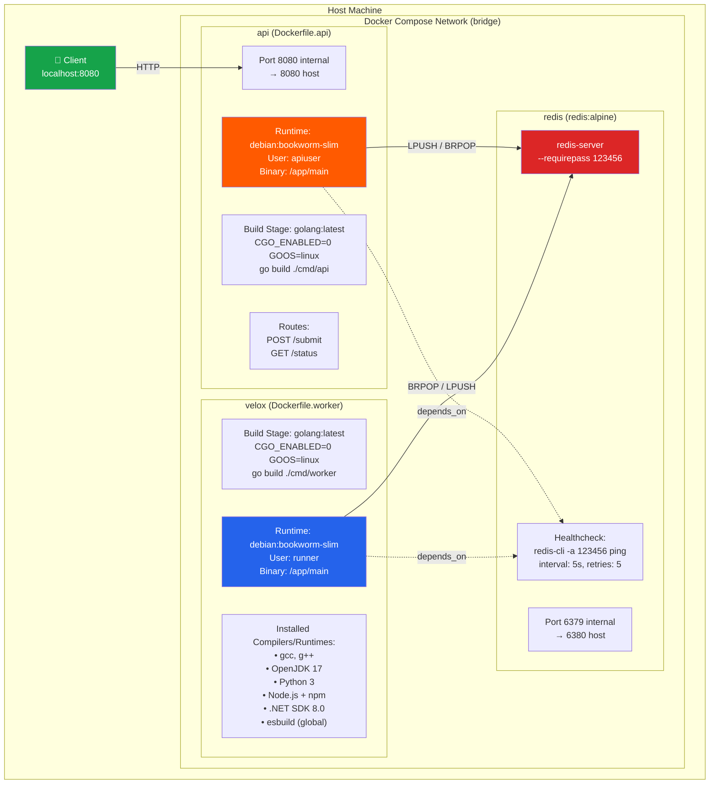
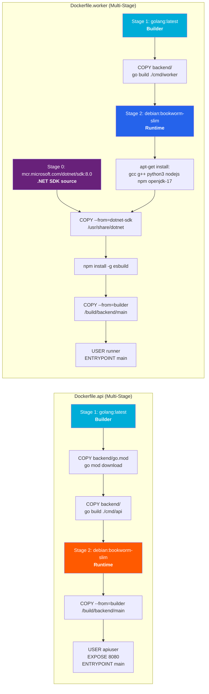
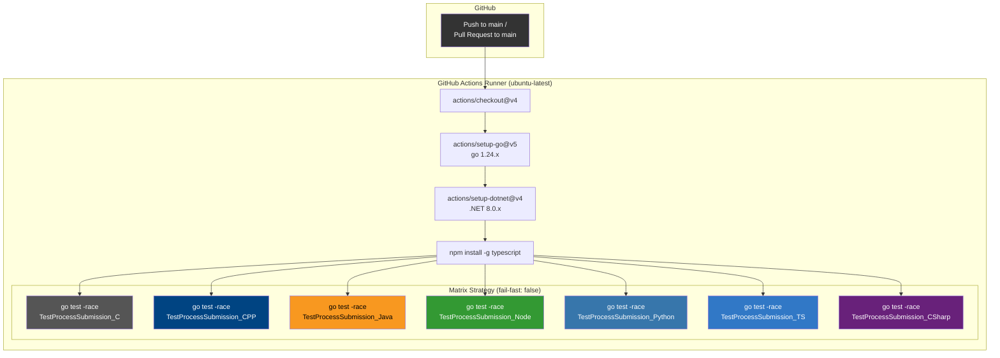
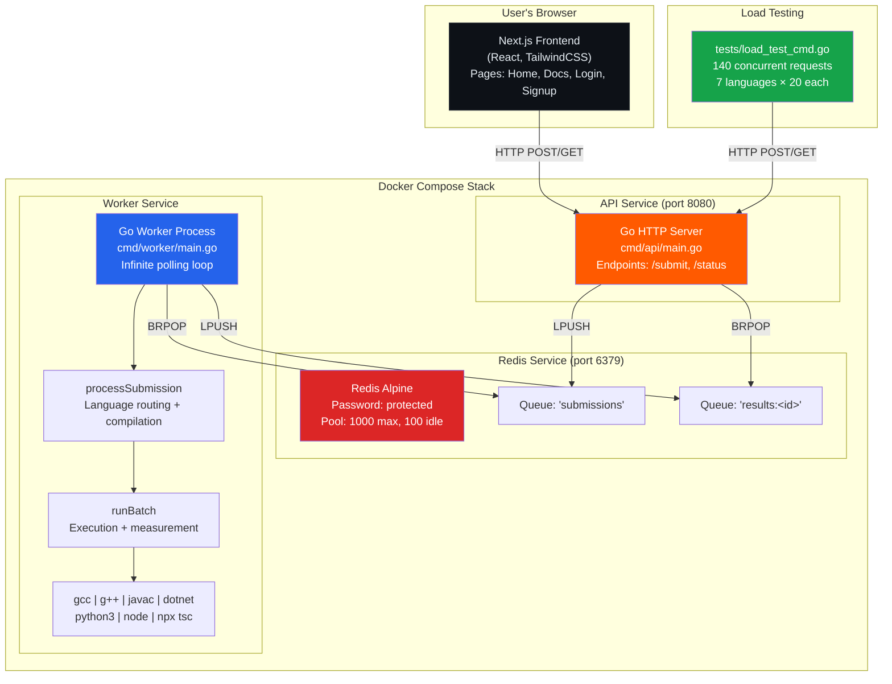

# 6. Component & Deployment Diagram

This document shows the **physical deployment topology** — Docker containers, networks, ports, and how the system is built and deployed.

---

## 6.1 Docker Deployment Diagram

---

## 6.2 Build Pipeline Diagram

Shows how the Docker images are constructed with multi-stage builds.

---

## 6.3 CI/CD Pipeline Diagram

---

## 6.4 Full System Architecture Diagram

This combines the frontend, backend, and infrastructure into one view.

---

## 6.5 Environment Variables

| Variable | Service | Default | Description |
|----------|---------|---------|-------------|
| `REDIS_ADDR` | api, worker | `localhost:6379` | Redis connection address |
| `REDIS_PASSWORD` | api, worker | `123456` | Redis authentication password |

---

## 6.6 Port Mapping

| Service | Internal Port | External Port | Protocol |
|---------|--------------|---------------|----------|
| Redis | 6379 | 6380 | TCP |
| API Server | 8080 | 8080 | HTTP |
| Worker | — | — | No exposed ports |

---

## 6.7 Explanation

### Why This Architecture?

| Decision | Rationale |
|----------|-----------|
| **Separate API and Worker containers** | The API is lightweight (just HTTP + Redis). The Worker is heavy (compilers + runtimes). Separating them allows independent scaling — you can run 1 API and 10 Workers behind the same Redis queue. |
| **Redis as the message queue** | Simple, battle-tested, and already provides `BRPOP` for blocking pops. No need for Kafka or RabbitMQ at this scale. |
| **Multi-stage Docker builds** | The final API image is ~50 MB (just a static Go binary + CA certs). The worker image is larger due to compilers. Multi-stage builds keep the image sizes minimal. |
| **Non-root users** | Both containers run as non-root (`apiuser` / `runner`) for security. This is especially important for the worker, which executes untrusted user code. |
| **Healthcheck on Redis** | Docker Compose uses healthchecks to ensure Redis is ready before starting the API and Worker. This prevents race conditions on startup. |
| **No persistent storage** | All data is transient in Redis. After results are consumed, they are gone. This is intentional — Velox is a stateless execution engine, not a database. If you need persistence, add a database layer on top. |
